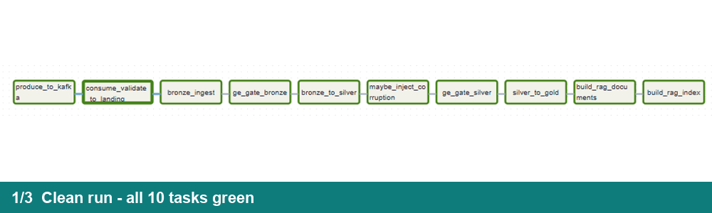
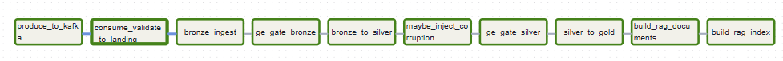
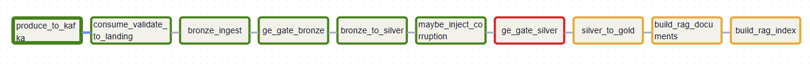
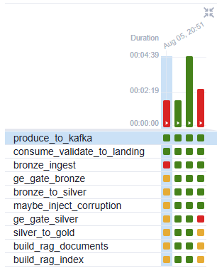

# 🏗️ Real-Time E-Commerce Data Platform with RAG — منصة بيانات لحظية بمساعد ذكي

> Capstone for the **SDAIA Academy** program **"Modern Data Engineering for AI Systems"** —
> a full production-style pipeline: real Kafka ingestion with a data contract,
> a Bronze/Silver/Gold Delta Lakehouse with a real MERGE, a hybrid-search RAG
> assistant with citations, all wired by an Airflow DAG whose quality gates
> **actually halt the pipeline** when bad data appears.
>
> مشروع ختامي لدورة «هندسة البيانات الحديثة لأنظمة الذكاء الاصطناعي»: أنبوب متكامل
> يستوعب معاملات حقيقية عبر Kafka بعقد بيانات، يخزّنها بطبقات Delta الثلاث بدمج MERGE
> حقيقي، ويبني فوقها مساعد أسئلة RAG ببحث هجين واستشهادات — كله بتنسيق Airflow
> وبوابات جودة **توقف الأنبوب فعلاً** عند البيانات الفاسدة.

## 🎬 Demo — the pipeline in action


https://github.com/user-attachments/assets/4c8633c6-aa90-4edc-b775-ec320f0ca999


🎥 **[Short demo video (35s)](docs/demo_short.mp4)** — the Airflow grid across all four
runs, the graph views, and the halted failure run ·
**[Full walkthrough (2:32, 2x speed)](docs/demo_walkthrough.mp4)**



**The two moments that matter** — a fully green clean run, and the deliberate-failure
run where the silver quality gate catches injected duplicate keys and every
downstream stage is halted (`upstream_failed`) before it can run:

| ✅ Clean run — all 10 tasks green | ⛔ Failure demo — gate halts downstream |
|---|---|
|  |  |

**Full run history (Grid view)** — an early real bug (red `bronze_ingest`, an
OpenLineage UUID issue, fixed in commit `62c1417`), two fully green runs
(initial load + batch-B MERGE), then the deliberate gate-halt demo:



**A real answer with citations** (extractive, grounded in retrieved chunks):

```text
Q: What is the top product by revenue and how many invoices does it appear in?

BM25              Vector            RRF               Rerank
22423_chunk_005   84952C_chunk_005  22423_chunk_005   22423_chunk_005   <- each stage re-ranks

A: [REGENCY CAKESTAND 3 TIER] It ranks 1 out of 1581 products by total revenue.
   It is the top product by revenue: the number one best-selling,
   highest-revenue product in the entire catalog. [Source 1] ...

Sources: [Source 1] chunk_id=22423_chunk_005 doc_id=22423 ...
```

## 📋 Deliverables and their evidence (executed runs, not just code)

| # | Deliverable | Proof in this repo |
|---|---|---|
| 1 | **Kafka ingestion** — producer + consumer, Pydantic contract at the boundary, dead-letter topic | [`evidence/ingestion/`](evidence/ingestion/) — 5,000 events accepted; 3 malformed events dead-lettered, each with a **distinct recorded rejection reason** |
| 2 | **Delta Lakehouse** — bronze/silver/gold, real MERGE on a business key, schema enforcement | [`evidence/delta/`](evidence/delta/) — one atomic MERGE: **1,908 updated + 1,947 inserted**; an undeclared-column write **refused** by Delta |
| 3 | **RAG pipeline** — chunking, embeddings, ChromaDB + BM25, RRF fusion, cross-encoder rerank, citations | [`evidence/rag/`](evidence/rag/) — 3 answered queries with `[Source N]` citations + a per-stage ranking comparison proving every stage matters |
| 4 | **Airflow orchestration** — correct dependencies; failed gate halts downstream | [`evidence/airflow/`](evidence/airflow/) — screenshots + task states: `ge_gate_silver` **failed** → `silver_to_gold`, `build_rag_*` all **upstream_failed** |
| 5 | **Quality gate + lineage** — Great Expectations checkpoints that gate; OpenLineage per stage | [`evidence/ge_lineage/`](evidence/ge_lineage/) — checkpoint results (pass **and** fail) + START/COMPLETE/FAIL events sharing **one runId per pipeline run** |

## 🏛️ Architecture

```
producer.py ──► Kafka topic: retail_transactions ──► consumer.py + Pydantic contract
                                   │ valid                     │ malformed
                                   ▼                           ▼
                            Bronze (Delta, raw+audit)   dead-letter topic (+ reason)
                                   │ GE gate (contract-level checks)
                                   │ dedupe → date parsing → grain aggregation → MERGE
                                   ▼
                            Silver (Delta)  ◄── schema enforcement (bad write refused)
                                   │ GE gate (compound uniqueness — the halting gate)
                                   ▼
                            Gold (Delta, ranked genuine aggregate)
                                   │
       product docs ──► chunking (doc_id/chunk_id, overlap) ──► ChromaDB + BM25
                        ──► RRF fusion (k=60) ──► cross-encoder rerank
                        ──► extractive answer with [Source N] citations

Airflow DAG: produce → consume/validate → bronze → gate → silver → [inject?] → gate → gold → docs → index
OpenLineage: START / COMPLETE / FAIL per stage, unified runId          (failed gate ⇒ downstream halted)
```

Details: [`docs/ARCHITECTURE.md`](docs/ARCHITECTURE.md) · Requirements & acceptance criteria: [`docs/PRD.md`](docs/PRD.md)

## 🚀 How to run

Prerequisites: **Docker Desktop** only — everything runs in containers.

```bash
git clone https://github.com/AK7Amin/SDAIA-DATA-Engineering.git
cd SDAIA-DATA-Engineering
docker compose up --build -d        # Kafka (KRaft) + Airflow with an isolated compute venv
```

1. Put the dataset in place (one time): download the
   [UCI Online Retail zip](https://archive.ics.uci.edu/static/public/352/online+retail.zip)
   into `data/online_retail.zip`, then `python src/prepare_data.py`.
2. Open **http://localhost:8080** (user `admin`, password `admin` — dev only).
3. Trigger `capstone_pipeline` with default params → expected: all 10 tasks green.
4. Trigger again with `{"batch": "B", "inject_malformed": 0}` → expected: MERGE
   metrics show updates **and** inserts.
5. Trigger with `{"inject_corruption": true}` → expected: `ge_gate_silver` fails,
   everything downstream is halted. Run the `reset_demo_state` DAG to clean up.
6. Ask the assistant:
   ```bash
   docker exec capstone-airflow /opt/venvs/compute/bin/python \
     /opt/capstone/src/rag/answer.py "Tell me about lantern products" --compare
   ```

## 🧪 Tests

23 unit tests over the pure-Python core (contract gate, chunking, RRF math):

```bash
python -m pytest tests -q      # 23 passed
```

They earn their keep: the contextual-header change to chunking was caught by two
failing tests before it could ship silently.

## 📦 Dataset

[UCI Online Retail](https://archive.ics.uci.edu/dataset/352/online+retail) — 541,909
real transactions (2010–2011) with genuine quality problems (25% missing CustomerID,
negative quantities = real cancellations, 5,268 duplicates) that exercise every
failure path honestly.

Citation (CC BY 4.0): Chen, D. (2015). *Online Retail* [Dataset].
UCI Machine Learning Repository. https://doi.org/10.24432/C5BW33

## 👥 Team

- Abdulaziz Mulia — عبدالعزيز بن خالد مليا
- Saif Abukhamis — سيف بن نايف أبوخميس
- Feras Al-Harbi — فراس بن محمد الحربي
- Faisal Al-Abdul-Jabbar — فيصل بن عبدالله العبدالجبار

## 🎓 Training program attribution

This project was completed as the capstone for **"Modern Data Engineering for AI
Systems"**, a 5-day training program by **SDAIA Academy** (delivered via Learning
Space), trainer Mohammed Albeladi, session dates 2–6 August 2026.

SDAIA Academy on GitHub: **https://github.com/SDAIAAcademy**
