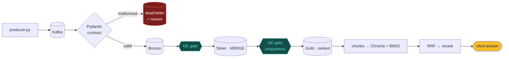

# Real-Time E-Commerce Data Platform <span style="color:#fbbf24">with RAG</span>

<div class="ar text-2xl opacity-90 pt-2" style="text-align:center">منصة بيانات لحظية بمساعد ذكي</div>

<div class="note pt-10">
Abdulaziz Mulia · Saif Abukhamis · Feras Al-Harbi · Faisal Al-Abdul-Jabbar
<br>SDAIA Academy — Modern Data Engineering for AI Systems
<br>Trainer: Mohammed Albeladi · August 2026
</div>

<!-- عرض تجريبي مبني بـ Slidev من ملف Markdown واحد -->

---
layout: center
---

# 541,909 real transactions <span style="color:#a8b2d8">— and real defects</span>

<div class="grid grid-cols-4 gap-5 pt-8">
  <div class="stat"><b>541,909</b><span>UCI retail rows</span></div>
  <div class="stat"><b>25%</b><span>missing CustomerID</span></div>
  <div class="stat"><b>5,268</b><span>exact duplicates</span></div>
  <div class="stat"><b>−80,995</b><span>negative quantities</span></div>
</div>

<div class="ar pt-10 text-lg opacity-85">هذه العيوب ليست مشكلة — هي وقود «إثبات مسارات الفشل» الذي يطلبه التقييم حرفياً</div>

---

# Architecture



<div class="note pt-2">Mermaid — the diagram is text, so it never drifts from the code</div>

---

# The contract gate

````md magic-move
```python
# 1) every Kafka message must pass this class…
class RetailTransaction(BaseModel):
    InvoiceNo: str
    Quantity: int          # "many" -> ValidationError
    InvoiceDate: str
```

```python
# 2) …with validators that explode on garbage
@field_validator("InvoiceNo")
def invoice_format(cls, v):
    if not re.match(r"^[A-Za-z]?\d{5,6}$", v):
        raise ValueError(f"InvoiceNo format invalid: '{v}'")
    return v.strip()
```

```python
# 3) the consumer routes every explosion to the DLQ — with the reason
except ValidationError as exc:
    dlq.send(TOPIC_DLQ, {
        "rejected_record":  record.value,
        "rejection_reason": str(exc).splitlines()[0],
        "source_offset":    record.offset,
    })
```
````

<div class="ar pt-4 opacity-85">الكود يتحوّل أمام الجمهور بين المراحل الثلاث — اضغط سهم يمين</div>

---

# What the dead-letter topic recorded

```json {2-3|4-5|6-7}
[
  {"rejection_reason": "InvoiceNo format invalid: 'FREE-STUFF'",
   "source_offset": 5000},
  {"rejection_reason": "InvoiceDate not parseable: 'not-a-date'",
   "source_offset": 5001},
  {"rejection_reason": "Quantity: input should be a valid integer",
   "source_offset": 5002}
]
```

<v-click>
<div class="pt-6 text-xl">
5,000 accepted · <span style="color:#fbbf24">3 rejected with distinct reasons</span> · 0 silently dropped
</div>
</v-click>

---
layout: two-cols
layoutClass: gap-10
---

# One atomic MERGE

```python {1-4|5-6|all}
(target.alias("t")
  .merge(grain.alias("s"),
    "t.InvoiceNo = s.InvoiceNo AND "
    "t.StockCode = s.StockCode")
  .whenMatchedUpdateAll()
  .whenNotMatchedInsertAll()
  .execute())
```

::right::

<div class="pt-16"/>

## …and its receipt

```json
{
  "numTargetRowsUpdated":  "1908",
  "numTargetRowsInserted": "1947",
  "numSourceRows":         "3855"
}
```

<div class="ar note pt-4">دفعة متداخلة: التصحيحات حدّثت والجديد أُدرج — في معاملة واحدة</div>

---
layout: image
image: /failed_run.png
backgroundSize: contain
class: bg-[#273470]
---

<div class="absolute bottom-6 left-8 right-8 text-center" style="background:#273470ee;border-radius:12px;padding:0.7rem">
<span class="ar text-lg">البوابة أمسكت التكرارات المحقونة — <b style="color:#f87171">حمراء</b> — وكل ما بعدها <b style="color:#fbbf24">تجمّد تلقائياً</b></span>
</div>

---

# The halt, verbatim

```text {3|5|7}
[GE GATE] layer=silver rows=6985 success=false
  [PASSED] expect_column_values_to_not_be_null
  [FAILED] expect_compound_columns_to_be_unique
[GE GATE] result -> evidence/ge_lineage/checkpoint_silver_fail_*.json
Command exited with return code 1
...
airflow: Marking task as FAILED. task_id=ge_gate_silver
```

<v-click>
<div class="ar pt-6 text-lg opacity-90">لم نكتب منطق إيقاف — <code style="color:#33cc99">exit 1</code> + قاعدة <code style="color:#33cc99">all_success</code> الافتراضية = الأنبوب يوقف نفسه</div>
</v-click>

---

# Hybrid retrieval — every stage re-ranks

| BM25 | Vector | RRF | Rerank |
|---|---|---|---|
| <span v-mark.circle.orange="1">22423_005</span> | 22423_006 | 22423_006 | <span v-mark.underline.green="2">22423_005</span> |
| 22423_006 | 22423_005 | 22423_005 | 22423_006 |
| 21915_006 | 84952C_005 | 22752_005 | 22752_005 |

<v-click at="3">

```text
Q: Which product has the highest revenue in the catalog?
A: [REGENCY CAKESTAND 3 TIER] It ranks 1 out of 1791 products
   by total revenue… [Source 1]
```

</v-click>

---
layout: center
class: text-center
---

# <span class="ar">خمسة متطلبات، خمسة أدلة،<br>وأنبوب ينجح ويفشل بصدق</span>

<div class="pt-8 text-xl" style="color:#33cc99">
github.com/AK7Amin/SDAIA-DATA-Engineering
</div>

<div class="ar note pt-10">هذا العرض نفسه: ملف Markdown واحد — تجربة Slidev</div>
